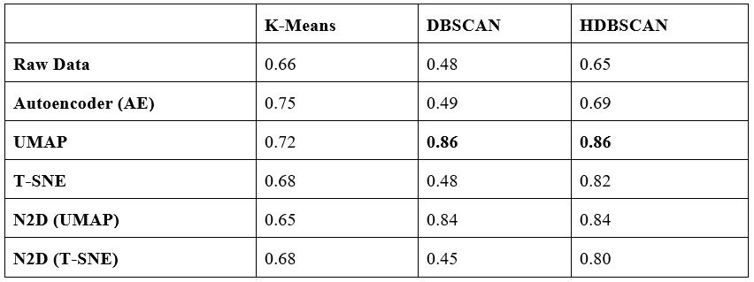
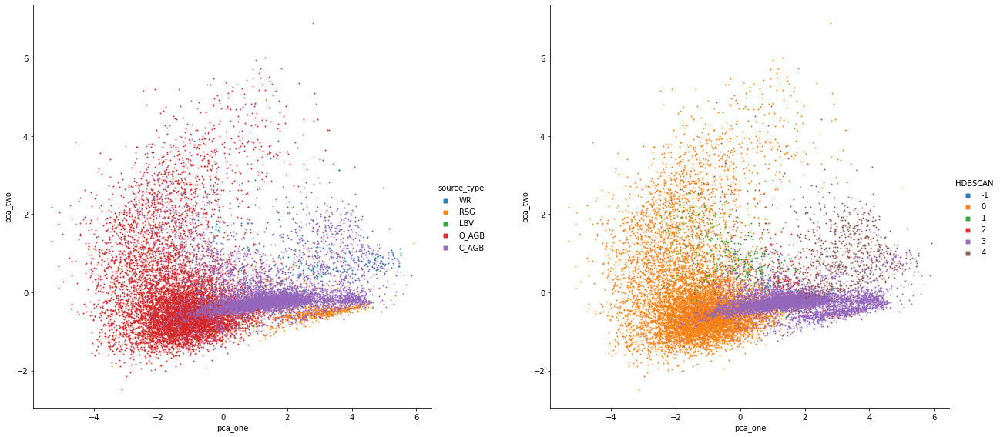

## Unsupervised-Classification-of-Evolved-Stars

## Abstract
The next-generation of observational astronomy instrumentation is expected to generate massively large and high complexity data volumes (big data) at rates of several gigabytes per second. Such enormous volumes impose extremely challenging demands on traditional approaches for data processing and analysis. In this context, machine learning algorithms are playing an increasingly important role in the classification of celestial objects in big data volumes. This report focuses on analysing the effectiveness of unsupervised machine learning algorithms for the application of classifying evolved stars using multi-wavelength photometric measurements as input. Research outcomes include a custom made reference dataset compiled from available stellar catalogues for target sources - Asymptotic Giant Branch, Wolf Rayet, Luminous Blue variable and Red Supergiant stars. The dataset is composed of approximately 16,000 sources and features 8 independent colours computed from magnitude values retrieved available photometric catalogues - Wise, 2MASS and Gaia, spectral features were not considered within the dataset. Our experimental results indicate that the clustering algorithm HDBSCAN can utilise photometric values effectively to classify these sources, with the highest result having attained 65\% accuracy with rand index when applied directly to the dataset. We further investigated the application of feature extraction techniques to the dataset, namely autoencoders and manifold learning algorithms UMAP and T-SNE. Our results show that these methods significantly improve clustering performance, and also result in the clear separation of oxygen-rich and carbon-rich AGB stars within the feature space, improving upon previous literature results. Our best result was achieved by combining UMAP and HDBSCAN, attaining an accuracy of 86\% with rand index. We envisage that our findings can be replicated across other datasets containing photometric data and potentially with spectroscopic data, towards achieving even higher accuracies - to this extent we plan to perform a future systematic experimentation. We are also planning to make our ML pipeline available within the NEANIAS cloud-based science gateway to provide an easy-to-use interactive testbed environment, inviting domain scientists to design, realise, evaluate and optimise customised classification workflows for evolved stars.

## Results

## Visualisation
Original labels (left) in comparison to HDBSCAN clustering after application of UMAP to the featureset (right)

## Publications
[ML4astro Poster](https://JamieAlanWelsh.github.io/Unsupervised-Classification-of-Evolved-Stars/PDF-files/poster.pdf)

[Ml4astro Proceedings Paper](https://link.springer.com/chapter/10.1007/978-3-031-34167-0_12)
